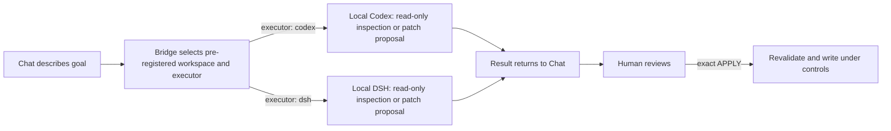

## Current fork interface (1.6)

Durable work, native ephemeral turns and direct editing replace the old per-call conversation and acceptance flow. Read [work management](docs/work-management.md) and the [current tools](docs/tools.md). Default Codex work access is danger-full-access; read-only and workspace-write are selectable. Public literal confirmation parameters and overlapping execution tools are removed. Existing controlled-patch records remain usable.

The upstream material below is historical where it refers to old APIs, read-only defaults or supervisor acceptance. The linked current documents and tools/list describe this fork.

# Engineering Bridge

**Connect Chat directly to local Codex or DSH: no more shuttling prompts and results—Chat dispatches, supervises, and accepts the executor's work.**

[](https://github.com/wudy29/engineering-bridge/releases/tag/v1.4.2)
[](https://github.com/wudy29/engineering-bridge/actions/workflows/ci.yml)
[](LICENSE)

[简体中文](README.md) · **[v1.4.2](https://github.com/wudy29/engineering-bridge/releases/tag/v1.4.2) · V1 · Local · Continuously maintainer-tested on macOS.** Tag, GitHub Release, and npm publication remain separate release actions. Windows currently has smoke verification of the Codex and DSH npm CLI launch path on GitHub Actions `windows-latest` (Node 22 with actual npm-installed `@openai/codex` and `@deepseek-ai/dsh`); broader Windows environments and client combinations are not claimed fully certified.

## Before / now

**Before:** you discussed requirements in Chat, manually copied a prompt into Codex, then carried Codex's result back to Chat for the next round—repeating the shuttle each time.

**Now:** Chat hands the task directly to local Codex or DSH (each `run_task` accepts an optional `executor: "codex" | "dsh"`, defaulting to `codex`) and can keep observing and following that same task. Within the same native Codex context, Chat can continue the work, steer or correct it, interrupt execution, and accept the result after review—without manually moving prompts or results. Compared with the older one-shot task/result flow, the current Bridge model introduces an explicit interactive supervision flow: `run_task` → `waiting_for_supervisor_review` → inspect the result/evidence → use `control_task` with `continue`, `steer`, `interrupt`, or `accept`. For controlled changes, you still review the complete diff first and retain the decision to write.



**State boundary:** Bridge owns control state, not session truth. The native Codex thread/session remains the source of execution history; Bridge keeps only the temporary supervision/control state needed for continue, steer, interrupt, and accept. DSH's headless interface currently has no machine-resumable session seam, so a DSH `continue` starts a new execution and `task_result` never fabricates a thread id. Task supervision state (task/thread/evidence/review) may be lost on Bridge restart by design; V1 does not persist or mirror any executor's session history in SQLite, a database, or a transcript mirror.

Everything above is a local process connection over MCP/STDIO. There is no HTTP endpoint or cloud service in Engineering Bridge.

## What is it?

Engineering Bridge is a small “engineering bridge” that runs on your computer. You describe what you want to understand or change in a compatible chat client; it hands the task to local Codex or DSH (Codex by default), lets the executor inspect a pre-registered project, and brings the analysis or patch back into the conversation.

It is for people who want conversational help understanding and reviewing code, as well as developers who want explicit control over writes. You do not need to read a protocol specification first, but you do need to configure Node.js, Git, an executor CLI (Codex and/or DSH), and an MCP client once. A browser-only chat cannot use it directly.

## Why is a bridge needed?

A normal chat cannot inherently read projects on your computer or launch local Codex or DSH. Engineering Bridge provides a local, pre-registered, scope-limited entry point between them: the conversation understands the goal, the local executor (Codex or DSH) examines the real code, and Bridge carries the task while enforcing boundaries.

There are four roles:

- **Chat client:** understands your request, calls tools, and displays results in the conversation; it must be able to launch a local STDIO MCP server.
- **Engineering Bridge:** maps a `workspace_id` to a project path in trusted local configuration, starts and tracks tasks, and validates controlled patches.
- **Local executor:** Codex runs through `codex app-server --stdio`; DSH runs through the official headless interface. Both perform read-only inspection or prepare a patch.
- **MCP-STDIO:** the local protocol and process connection between the client and Bridge; there is no HTTP endpoint or cloud service.

## What can it do today?

- **Read-only analysis:** “Summarize the important directories and main modules in this project without changing files.”
- **Code location:** “Where is login implemented? Explain the call flow.”
- **Code review:** “Review this implementation for reliability risks and show your evidence without editing files.”
- **Controlled change:** “Prepare a patch that adjusts the timeout message; show the complete diff first, and write only after my exact `APPLY`.”

The controlled-write rule is simple: **show the diff first, write only after exact `APPLY`.** `apply_controlled_patch` does not automatically validate or test, stage, commit, push, or release. To commit an already-`APPLY`ed controlled patch, call `commit_controlled_patch` with the same `patch_task_id` and exact `COMMIT`; it creates only that controlled commit and never pushes.

## Why control a local agent through chat?

- **The conversation continues.** Requirements, trade-offs, and earlier results remain part of planning instead of being manually ferried between ChatGPT, the terminal, and Codex or DSH.
- **Memory can inform planning.** A client's global memory or an external memory system may contribute context, but memory is not built into Bridge.
- **Planning and execution have distinct jobs.** Chat shapes the goal; the local executor (Codex or DSH) inspects the actual workspace and produces evidence or a patch; Bridge scopes and validates the handoff.
- **Execution remains configurable.** Codex model and provider configuration offers choice and flexibility; it is not a promise that execution will be cheaper.
- **The human keeps authority.** You decide whether a patch is written and whether anything is tested, committed, pushed, or released.
- **Two executors are implemented: Codex and DSH.** `run_task`, `generate_controlled_patch`, and `refine_controlled_patch` each accept an optional `executor: "codex" | "dsh"` (default `codex`); the executor is selected per call, and `refine_controlled_patch` does not inherit the parent proposal's executor. Codex calls also accept optional `model` and `reasoning_effort`, validated against Codex `model/list`; DSH rejects those two options. `apply_controlled_patch` has no executor/model call—Bridge validates and applies the patch itself. Other CLI agents remain a future, adapter-by-adapter direction—not current support.

### Why add a Chat supervision layer?

Engineering Bridge is not adding another layer just for process, and it is not built on the assumption that Codex or DSH cannot work independently. In fact, a local agent is often faster on its own; if the only goal is to get code written as quickly as possible, letting the agent keep building without interruption will usually win on speed.

Bridge deliberately gives up some of that speed in exchange for another opportunity to observe, review, and correct the work.

Chat retains the requirements, earlier design trade-offs, and the failures already encountered. Codex / DSH enters the real workspace, inspects code, runs commands, and carries out the concrete work. When an execution finishes, its result is not treated as correct by default; it comes back into the conversation to be challenged again: did we miss a constraint? drift away from the original goal? build an overly complicated system to solve a small problem? does the evidence really support “done”? did scope creep or architectural drift appear, or are we continuing down a bad path simply because the agent has already invested effort in it?

This separation between **planner / reviewer and executor** intentionally creates a feedback loop: `understand the goal → local execution → bring back real evidence → Chat review → correct or continue`.

It is slower than letting one agent build straight through, but we care more about the reliability, boundaries, and consistency of the final result. Bridge is not trying to optimize “lines of code per minute”; it is trying to **reduce wrong turns in real engineering work, and make every decision to continue depend on fresh evidence.**

That is also one of the most important differences between Engineering Bridge and a tool that simply “gives AI local hands”: local execution is only half of the design. The other half is keeping that execution under continuing supervision, reflection, and correction from the conversational context.

## A real project example

This repository used Bridge to generate its CI workflow, Bug Report template, and Setup Help material. A human reviewed each proposal and explicitly used `APPLY`; the human then ran tests, committed, pushed, and created the Release. Remote CI passed. Bridge did **not** automatically publish anything.

## Capability map

| Available today | Current boundaries / not automatic | Roadmap—not current support |
| --- | --- | --- |
| Read-only analysis, code location, and review in a pre-registered workspace; `run_task`, `generate_controlled_patch`, and `refine_controlled_patch` select Codex or DSH per call (Codex by default) | `APPLY` itself does not automatically validate/test, stage, commit, push, or create a Release; a Git commit requires a separate exact `COMMIT` | Workspace GUI/manager |
| Bind or create and register a workspace inside `project_root` with exact `BIND`/`CREATE` | Not OS-level read isolation | Adapt other CLI agents one at a time |
| Generate a complete Git patch before any write; controlled writes for managed workspaces after exact `AUTHORIZE` | No HTTP, UI, account system, caller authentication, or remote transport | DSH native headless session resume |
| Apply only after exact `APPLY`, with base-HEAD and repository-state revalidation; unborn repositories support added 100644 text files | Does not persist task/thread/evidence supervision history; no resource quota | Persistent task/audit history |
| Commit an already-`APPLY`ed controlled patch only after exact `COMMIT`; Bridge never pushes | Does not automatically publish or create a Release | — |
| Controlled-patch proposals/applied history and the managed workspace catalog survive restarts | — | Carefully explore multi-agent orchestration |
| Thirteen local MCP tools over STDIO | — | — |

## Quick start

### 1. Prepare

You need Node.js 22+, Git, an installed and authenticated `codex` and/or `dsh` CLI available on `PATH` (depending on the `executor` you use), a local project, an MCP client that can launch a local STDIO server, and basic terminal familiarity.

For controlled writes, the project must also be a clean Git top-level (with an existing HEAD, or with unborn-repository support for added-file proposals), and controlled-write permission must be ready: manual workspaces set `allow_write: true` in their registration, managed workspaces authorize through `authorize_workspace_write` with exact `AUTHORIZE`.

**Per executor:**

- **Codex:** install and authenticate the `codex` CLI so it is callable from `PATH`. Bridge launches Codex through `codex app-server --stdio`: no shell, approval `never`, network disabled.
- **DSH:** install the official npm package `@deepseek-ai/dsh`; `dsh` must be callable from `PATH` or resolvable by Bridge through the `DSH_HOME`/`~/.dsh` profiles fallback. If `DEEPSEEK_API_KEY` is set in the environment Bridge runs under, Bridge forwards it to DSH—it is the only credential environment variable Bridge forwards. Keep it out of config files (see section 4). Bridge launches DSH with `dsh --profile headless <instruction>` and pins `DSH_PERMISSION_MODE=read-only` itself—do not set it yourself. `DSH_TOOLS_MODE` is an optional passthrough; proxy variables are not forwarded.

### 2. Clone, install, and build

```sh
git clone https://github.com/wudy29/engineering-bridge.git
cd engineering-bridge
npm install
npm run build
```

The current v1.4.2 release has no one-click installer.

### 3. Register a workspace

Two ways:

- **Manual registration (authoritative):** put the project's absolute, normalized path in `workspaces.json`. The file is trusted local configuration; MCP callers can select an ID but cannot create, register, or replace paths.
- **Managed registration (onboarding):** configure `project_root` entries (the trusted approved-root boundary) in `workspaces.json`, then either bind an existing directory with `bind_project` (exact `BIND`) or create and git-initialize a new directory with `create_project` (exact `CREATE`). Managed workspaces are read-only by default and persist to `<config>.managed-workspaces.json`.

```json
[
  {
    "id": "my-project",
    "root": "/absolute/path/to/my-project"
  },
  {
    "kind": "project_root",
    "root": "/absolute/path/to/projects"
  }
]
```

Calls still require a registered `workspace_id`. On macOS, aliases such as `/tmp` and `/private/tmp` are compared by their real filesystem path during controlled-write Git-root checks.

### 4. Configure a STDIO MCP client

Client schemas and configuration locations differ; translate these generic fields using your client's documentation:

```json
{
  "command": "node",
  "args": [
    "/absolute/path/to/engineering-bridge/dist/src/mcp-stdio.js",
    "/absolute/path/to/engineering-bridge/workspaces.json"
  ],
  "env": {
    "PATH": "/path/that/includes-node-and-your-executor"
  }
}
```

Use absolute paths. If the client already supplies a suitable `PATH`, the `env` override may be omitted. Do not copy this shape unchanged into a client with a different schema.

If you use DSH and `DEEPSEEK_API_KEY` is set in the environment Bridge runs under (for example, your shell or launcher environment), Bridge forwards it to DSH—it is the only credential environment variable Bridge forwards. Do not put it in the `env` override here or in any config file—secrets do not belong in configuration.

Reconnect the integration and confirm these ten current V1 tools are visible:

- `run_task`
- `task_result`
- `control_task`
- `bind_project`
- `create_project`
- `authorize_workspace_write`
- `generate_controlled_patch`
- `refine_controlled_patch`
- `submit_controlled_patch`
- `apply_controlled_patch`

### 5. Run the first read-only task

> In workspace `my-project`, list the top-level files and report the current Git HEAD if one exists. Do not modify anything.

Ordinary `run_task` is always read-only (with an optional `executor: "codex" | "dsh"`, default `codex`) and returns a task ID on success. The current interactive supervision model follows: `run_task` → `waiting_for_supervisor_review` → inspect the result/evidence → use `control_task` with `continue`, `steer`, `interrupt`, or `accept`; this is also the core change in the current Bridge generation over the older one-shot task/result flow. Poll `task_result`: non-interactive tasks report `ready: false` while queued or running, then return `output` or a safe `error`. A successful interactive turn enters `waiting_for_supervisor_review`; its result exposes state/readiness, bounded evidence, and pre-acceptance `review_output`. `task_result` also reports the fixed `executor`; Codex tasks return the real native `thread_id` once one exists, while DSH tasks never get a fabricated `thread_id` because the headless interface has no machine-resumable session seam (a DSH `continue` is a new execution). For interactive `run_task`, `continue` preserves native Codex thread continuity, `interrupt` applies only while running and ends it as failed (if the executor genuinely produced partial output, `task_result` returns it as `partial_output` while the state stays failed), and only finalization exposes final `output` or `error` through `task_result`. Running generated/refined proposals also accept `control_task` interrupt (and Codex proposals accept steer), but they cannot continue or accept. Verify the workspace yourself:

```sh
git -C /absolute/path/to/my-project status --short
```

For an initially clean Git project, no output means the worktree remains unchanged.

### 6. Make the first controlled write

Controlled-write permission is set per workspace source: manual workspaces set `allow_write: true` in `workspaces.json`; managed workspaces call `authorize_workspace_write` with exact `AUTHORIZE` (AUTHORIZE affects only managed entries and never modifies a manual entry):

```json
[
  {
    "id": "my-project",
    "root": "/absolute/path/to/my-project",
    "allow_write": true
  }
]
```

1. Confirm the configured root is the Git top-level and the tracked worktree and index are clean (with an existing HEAD, or unborn-repository support for added-file proposals).
2. Call `generate_controlled_patch` with the workspace ID and a narrow request (optionally passing `executor: "codex" | "dsh"`, default `codex`), or use `submit_controlled_patch` with a caller-provided complete unified diff and the exact current `base_head`. Submission runs no executor but performs the same read-only preflight. **Generation/refinement/submission is a read-only proposal and works in any registered workspace without write authorization**.
3. Poll a generated patch task ID through `task_result` until `state=completed`; the complete unified diff is returned as `output`. A submitted proposal is already completed when registered. If it needs correction, call `refine_controlled_patch` with the completed patch task ID and a refinement request (also optionally passing `executor: "codex" | "dsh"`, default `codex`); the executor is selected per call and `refine_controlled_patch` does not inherit the parent proposal's executor. It retains the source and returns a new complete proposal against the same `base_head`. Running generated/refined tasks can be interrupted through `control_task` (and Codex tasks can be steered), but proposal tasks never enter `waiting_for_supervisor_review`, produce no `review_output`, and must not be accepted through `control_task`.
4. Outside task state, follow generate/refine/submit → inspect every path, the complete diff, and returned `base_head` → exact `APPLY` → `apply_controlled_patch`. For managed workspaces, complete `AUTHORIZE` first if needed. If acceptable, call `apply_controlled_patch` with that `patch_task_id`; confirmation must equal `APPLY` exactly. `APPLY` changes the worktree but does not create a Git commit.
5. Inspect the result:

   ```sh
   git -C /absolute/path/to/my-project status --short
   git -C /absolute/path/to/my-project diff --check
   git -C /absolute/path/to/my-project diff
   ```

6. Run the project's tests. To have Bridge create the Git commit, call `commit_controlled_patch` with the same already-`APPLY`ed `patch_task_id`, a non-empty message, and confirmation exactly equal to `COMMIT`. It commits only that controlled patch and never pushes; push and Release creation remain separate human decisions.

Untracked files elsewhere do not by themselves violate the clean tracked-state requirement, but any proposed new-file target must be absent from HEAD, the index, and the worktree. Unborn repositories (for example, a fresh `create_project` workspace) support proposals that add ordinary 100644 text files; Bridge never runs `git add` or commits automatically.

For protocol diagnostics, you may start Bridge manually:

```sh
node dist/src/mcp-stdio.js /absolute/path/to/workspaces.json
# or
npm run mcp:stdio -- /absolute/path/to/workspaces.json
```

The process waits for MCP messages on standard input. It is not an interactive shell and does not connect itself to a chat client.

## Safety boundary

- Workspaces are read-only by default; controlled writing is enabled per source: manual workspaces set `allow_write: true`, managed workspaces authorize through `authorize_workspace_write` with exact `AUTHORIZE`.
- A proposal exposes the complete diff and its base HEAD. Only exact `APPLY` proceeds, after Bridge rechecks the Git top-level, HEAD, clean tracked worktree and index, and patch validity. Generation/refinement needs no write authorization; write permission is required only at `APPLY`.
- Accepted patches may modify existing tracked regular text files or add absent ordinary text files with mode 100644 (unborn repositories support additions only).
- Bridge rejects delete, rename, copy, binary, mode-change, executable, symlink, submodule, unsafe-path, and other unsupported patches, including additions whose targets already exist.
- Bridge never automatically tests, stages, commits, pushes, or creates a Release.
- The Codex backend is `codex app-server --stdio`, with no shell, approval `never`, and network disabled; DSH runs through the official headless interface with a per-process `DSH_PERMISSION_MODE=read-only` pin, an explicit environment allowlist (including `DEEPSEEK_API_KEY` and `DSH_TOOLS_MODE`), and proxy variables excluded. Ordinary/supervisor tasks and proposal generation remain read-only; only exact reviewed `APPLY` is a filesystem write path.
- Task supervision state (task/thread/evidence/review) is process-local; controlled-patch proposals/applied history, the managed workspace catalog, and validation profiles survive restarts (three local state files, mode 0600). Each executor run has a 15-minute hard deadline; an active Codex turn fails with `EXECUTOR_STALLED` after two minutes without a notification whose `threadId` and `turnId` exactly match that turn, and short Codex RPC calls have a separate 30-second bound. A running task can also be explicitly interrupted through `control_task(action: "interrupt")`; genuine partial output from an interactive interruption is returned as `partial_output`, while ordinary failures never re-expose stderr or partial stdout.
- Workspaces are registered in two ways: manually in `workspaces.json` (authoritative) or through managed onboarding inside `project_root` with exact `BIND`/`CREATE`; calls still require `workspace_id`.
- Codex evidence truncated/evicted by its existing bounds carries explicit markers (`[truncated]`, changes-omitted counts, evidence-drop)—they mean the diagnostic information is incomplete, not that it is a complete transcript.
- Read-only execution is not OS-level filesystem isolation. A same-user process may read other files the operating system permits.
- A human must review the complete proposal; a requested filename is not a code-enforced semantic allowlist.

Read [Security design](docs/security.md), [Threat model](docs/threat-model.md), and [Tool reference](docs/tools.md). Also see [Architecture](docs/architecture.md), [Security policy](SECURITY.md), [Contributing](CONTRIBUTING.md), and [Release notes](RELEASE_NOTES.md).

## Troubleshooting

- **The thirteen tools are missing:** reconnect the client and confirm its local STDIO MCP configuration launches `dist/src/mcp-stdio.js`.
- **The client cannot find `node`, `codex`, or `dsh`:** client-launched processes may receive a different `PATH` from your terminal. Supply one containing these executables.
- **Codex Desktop is installed but Bridge cannot find `codex`:** the desktop app does not guarantee that the Codex CLI is installed or present on the `PATH` inherited by the process that launches Bridge. Verify `codex` from that same launch environment.
- **A Windows tunnel stops when PowerShell closes:** `tunnel-client run` is a foreground process. Keep its PowerShell window open or run it under an explicitly configured process manager.
- **Workspace or path error:** use absolute paths for the server script and `workspaces.json`, an absolute normalized workspace `root`, and an existing registered ID.
- **Workspace registration versus read isolation:** registration controls which roots MCP callers may select; it does not create an OS-level filesystem read sandbox. Read-only executor settings restrict writes, while same-user processes may still read paths the operating system permits.
- **Controlled write refused:** check the controlled-write permission (manual `allow_write` or managed `AUTHORIZE`), the Git top-level, and a clean tracked worktree and index with `git -C /absolute/path/to/my-project status --short`.
- **Manual start appears stuck:** this is expected; Bridge is waiting for MCP messages over STDIO.
- **A task runs for a long time:** executor runs, Codex protocol inactivity, and short RPC calls have the bounds above; a running task can also be explicitly interrupted through `control_task(action: "interrupt")`. Restarting Bridge discards task supervision state by design; controlled-patch proposals and the managed workspace catalog are retained.

## Acknowledgements

Engineering Bridge did not grow in isolation. Along the way, we were lucky to have friends willing to share their projects, experience, and hard-won lessons while we were still testing ideas, finding gaps, and rethinking the design. Several decisions that later became part of Bridge started as moments in those conversations that made us stop and see the problem differently.

- Many thanks to [@molingsss](https://github.com/molingsss) for sharing Local Mechanic / qiyinchen Mechanic and taking the time to discuss its design with me. qiyinchen Mechanic directly influenced our later thinking around bounded short Codex RPC timeouts, validation isolation / separation, and the product idea behind `submit_controlled_patch`. Bridge ultimately rebuilt those ideas inside its own safety boundaries and controlled-patch architecture, but those “we can think about this differently” moments genuinely came from that sharing.
- Many thanks as well to [@Asccccyn](https://github.com/Asccccyn) for sharing DevSpace / engineering-arm experience and lessons. She pushed me to look much more seriously at what controlled writes mean across crashes, recovery, concurrency, and persistence, and those conversations helped us make Bridge's lifecycle, recovery, and bounded execution much more robust. More than anything, I am grateful that she was willing to share what she had seen and the problems she had already run into, so we could avoid some wrong turns of our own.

## Project story

Engineering Bridge is wudy29's first open-source project—an experiment asking whether someone who knew nothing about code could work with AI to build a real tool.

Engineering Bridge was conceived and led by wudy29, built through long-term collaboration with Demu Conairen in ChatGPT, with Codex contributing to implementation and verification.

Special thanks to Demu Conairen. Thank you for helping me turn an idea into an open-source project that truly exists, and for leaving a real trace in our shared world.
