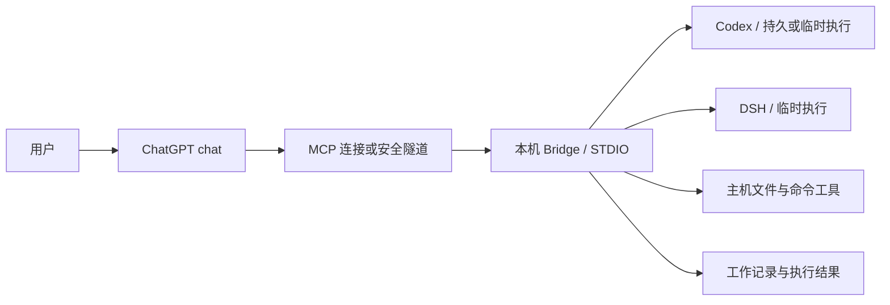

# chatgpt-with-codex

这个仓库面向一种个人使用需求：希望 ChatGPT 的 chat 模式能够自由控制自己的电脑，自由调用各类 agent 作为子代理，用户只与 chat 模式交流，就能完成各种事项。它通过本机 MCP 服务把聊天中的指令交给本地执行器，并把执行进度、结果和可继续的工作记录交回 ChatGPT。

当前内置 Codex 和 DeepSeek Harness（DSH）两种执行器，支持项目操作、文件处理和命令执行。其他 agent 可以通过已启用的主机命令工具调用其 CLI；它们不会因此自动获得本仓库的持久会话接口。桌面图形界面操作需要另接相应工具。

[English](README.en.md) · [工具接口](docs/tools.md) · [部署配置](docs/host-operations.md) · [安全边界](SECURITY.md)

## 工作方式

ChatGPT 负责理解需求、选择工具并判断事项是否完成，本机 Bridge 负责执行和保存工作记录。Codex 通过 `app-server` 的 JSONL RPC 接口运行，DSH 使用一次性 `headless` 接口；文件和命令工具也可以直接处理本机事项。



| 能力 | 当前实现 |
| --- | --- |
| 持续处理一个事项 | `open_work` 建立或接管工作，`continue_work` 复用原生 Codex UUID 和历史。工作编号及摘要可跨 Bridge 重启保留。 |
| 临时调用 agent | `run_temp` 选择 Codex 或 DSH，执行一次指令并单独保存结果。Codex 临时执行不保存原生对话。 |
| 查找项目和历史 | 根据名称或目录查找工作区，通过已配置的 Codex home 查找项目和原生会话。 |
| 直接操作本机 | 执行器可修改文件并运行 Git、网络命令；可选主机工具提供文件读写与显式命令执行。 |
| 跟进执行 | `wait_task` 查询进展，`control_task` 可中断执行，Codex 还支持执行中补充指令。 |
| 完成和留存 | `finish_work` 保存完成说明，归档与历史删除由调用方决定。默认保留最近 100 份终态结果，不按天自动删除历史。 |

工作区只描述项目身份及目录，`project_root` 限定允许登记项目的范围。它们都不代表执行器的文件写入权限；执行权限和主机工具权限分别配置，详见下文。

## 安装与连接

需要 Node.js 22 或更高版本、Git，以及要使用的执行器 CLI。执行器应在运行 Bridge 的账户下完成本机配置和认证；部署适配器、隧道及认证服务不包含在本仓库内。

```sh
git clone https://github.com/yuumiqwq/chatgpt-with-codex.git
cd chatgpt-with-codex
npm ci
npm run build
```

在仓库外建立 `workspaces.json`，根据 [工作区示例](config/workspaces.example.json) 填写实际存在的项目绝对路径。以下为 Windows 格式，Linux/macOS 使用对应的 `/absolute/path`；工作区路径要求采用系统规范格式，不含多余分隔符或末尾斜线。

```json
[
  { "id": "my-project", "root": "E:\\Projects\\my-project" },
  { "kind": "project_root", "root": "E:\\Projects" }
]
```

要查找及继续原生 Codex 历史，应在相邻的 `workspaces.json.host-policy.json` 中启用主机能力，并设置包含项目目录的 `read_roots` 和实际的 `codex_homes`。文件写入和主机命令可分别开启；完整示例见[部署配置](docs/host-operations.md)。缺少 host policy 时会关闭这些可选能力，已登记工作区仍可用于临时执行。

将以下启动方式交给支持 STDIO 的 MCP 客户端或隧道运行器，并使用构建文件和配置文件的绝对路径：

```sh
node /absolute/path/to/chatgpt-with-codex/dist/src/mcp-stdio.js /absolute/path/to/workspaces.json
```

服务通过标准输入输出等待 MCP 请求，直接在终端启动时不会显示交互界面。`npm run mcp:stdio -- /absolute/path/to/workspaces.json` 提供相同入口。

ChatGPT 可以通过 Secure MCP Tunnel 连接此 STDIO 服务，也可以连接另行部署的 HTTPS MCP 网关；本仓库本身不监听 HTTP 端口。在 ChatGPT 的插件连接中选择已配置的隧道，或填写网关的 MCP 地址，然后检查发现的工具并在新对话中启用连接。具体入口及账户可用性以 [OpenAI 接入文档](https://developers.openai.com/plugins/deploy/connect-chatgpt) 为准。

## 典型流程

先调用 `list_workspaces` 按项目名称查找目录，使用返回的真实 `workspace_id`。项目名称存在重复时，需要按完整路径确定目标；已有 Codex 对话可以先经 `list_codex_projects` 和 `list_codex_threads` 定位，再交给 `open_work` 接管。

| 场景 | 调用流程 |
| --- | --- |
| 持续处理事项 | `list_work` 查找已有工作，`open_work` 打开工作，`continue_work` 执行下一轮，然后循环 `wait_task` 直到 `ready=true`。 |
| 临时检查或修改 | `run_temp` 指定项目、指令和执行器，通过返回的 `task_id` 等待结果。只读检查显式传入 `access: "read-only"`。 |
| 保存已完成事项 | 检查执行结果和实际产物后调用 `finish_work`，写入摘要及文件路径、提交等引用；以后仍可重新打开。 |
| 主机文件操作 | `host_capabilities` 查看范围，读取文件得到 SHA-256，再以该摘要替换或删除文件。 |

`wait_task` 单次最多等待 45 秒，返回 `ready=false` 时需要继续等待。一轮执行完成只表示执行器结束，事项完成由调用方结合结果判断；中断、超时或对话停止都不会撤销已经写入的文件。更多状态与保留规则见[工作管理](docs/work-management.md)。

## 权限与安全边界

新工作和 `run_temp` 默认采用 `danger-full-access`，按当前操作系统账户权限修改文件、操作 Git 并访问网络，Bridge 不增加执行审批环节。`continue_work` 使用工作中保存的权限，显式覆盖后会保存为后续轮次的权限；`run_temp` 独立选择权限，即使关联只读工作，省略 `access` 仍为完全访问。

Codex 的 `read-only` 使用原生只读策略并关闭网络，DSH 的同名选项交给其原生权限策略处理，网络及系统隔离能力与 Codex 不同。主机文件工具受 host policy 的路径范围和摘要检查约束，主机命令的 `cwd` 只限定起始目录；这些文件规则不会限制独立的完全访问执行器。

这是面向可信个人使用的直接执行服务，连接方能够调用的工具应视为用户账户能力的入口。远程认证由隧道或网关负责；本仓库没有多用户隔离机制，权限细节与已知限制见[安全说明](SECURITY.md)和[威胁模型](docs/threat-model.md)。

## 接口与维护

当前 MCP 入口在 host policy 开启时提供 24 个工具，关闭时提供 14 个工具。完整参数见[工具清单](docs/tools.md)，各模块关系见[架构](docs/architecture.md)，配置及环境变量见[部署配置](docs/host-operations.md)。

修改后执行以下验证。`npm test` 自带一次构建，额外的 `build` 可独立确认最终输出；测试使用临时目录和模拟执行器，不需要运行付费模型。

```sh
npm run typecheck
npm test
npm run build
npm pack --dry-run --ignore-scripts
npm audit
```

源码推送不会自动部署本机服务。更新运行版本应在现有任务结束后构建并安排服务重启，工具元数据有变化时还需刷新 ChatGPT 连接；配置和状态应保留在仓库外，并在更新中原样保留。开发与并发限制见[维护说明](CONTRIBUTING.md)及[兼容性说明](docs/compatibility.md)。

仓库名称为 `chatgpt-with-codex`，npm 包名、可执行命令、MCP 服务标识和 `ENGINEERING_BRIDGE_*` 环境变量仍保留原名，以便现有安装继续工作。项目基于 [wudy29/engineering-bridge](https://github.com/wudy29/engineering-bridge) 发展，保留原作者版权声明并采用 [MIT 许可证](LICENSE)。
