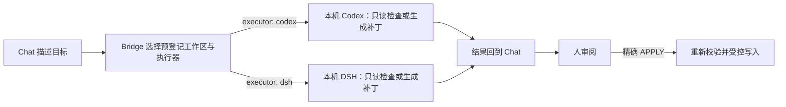

## 当前 fork：持续工作与临时执行

本分支已改用统一工作接口，使用方式见 [工作管理说明](docs/work-management.md) 和 [当前工具表](docs/tools.md)。open_work 同时处理新建、重新启用及接管已有对话；continue_work 复用已有 UUID；run_temp 运行临时任务，不留下新的 Codex 持久对话。默认允许 Codex 直接修改文件、操作 Git 和访问网络，也可按调用选择只读或工作区写入模式。

工作状态、摘要与结果保存在工作区配置旁的独立文件中。归档和删除由调用方决定，未启用按时间自动删除原生历史；执行结果默认保留最近 100 条。移除了重复执行接口及公开参数中的固定确认字符串，已有受控补丁记录仍可使用。

以下保留上游历史说明，其中旧工具名称、只读默认值和人工验收流程不再代表本分支当前接口；以以上两份文档及实时 tools/list 为准。

# Engineering Bridge

本地分支增加了等待任务、文件操作、本地会话查询和原生会话续接。续接默认允许 Codex 在原项目目录直接修改文件，也可选择只读分析；可选主机能力通过独立配置启用。配置方式与权限说明见 [Host operations](docs/host-operations.md)，上游版本信息保留如下。

**打通 Chat 与本地 Codex 与 Deepseek harness：不再搬提示词，Chat 直接调度、监督并验收 Codex 与 Deepseek harness。**

[](https://github.com/wudy29/engineering-bridge/releases/tag/v1.4.2)
[](https://github.com/wudy29/engineering-bridge/actions/workflows/ci.yml)
[](LICENSE)

[English](README.en.md) · **[v1.4.2](https://github.com/wudy29/engineering-bridge/releases/tag/v1.4.2) · V1 · 本地运行 · macOS 由维护者持续实测。** tag、GitHub Release 与 npm 发布仍是彼此独立的 release 操作。Windows 侧目前已有 GitHub Actions `windows-latest` 上的 Codex 与 DSH npm CLI 启动路径 smoke 验证（Node 22 + 实际 npm 安装的 `@openai/codex` 与 `@deepseek-ai/dsh`）；更广的 Windows 环境与客户端组合不做全面认证。

## 以前 / 现在

**以前：** 你先在 Chat 里讨论需求，再把提示词手工复制到 Codex；Codex 完成一轮后，你又把结果搬回 Chat 继续讨论，然后反复往返。

**现在：** Chat 直接把任务交给本机 Codex 或 DSH（每个 `run_task` 可选 `executor: "codex" | "dsh"`，默认 `codex`），并能继续观察、跟进同一个任务。在同一条原生 Codex 上下文中，Chat 可以让 Codex 继续工作、定向纠正、打断执行，并在审阅后验收结果；不再需要手工搬运提示词和结果。当前这代 Bridge 相比旧的一次性 task/result 流程，核心变化是明确的交互监督流：`run_task` → `waiting_for_supervisor_review` → 检查结果/证据 → 用 `control_task` 发送 `continue`、`steer`、`interrupt` 或 `accept`。对于受控修改，你仍先审阅完整 diff，并保留是否写入的决定权。



**状态边界：** Bridge 持有控制状态，不持有第二份会话事实。Codex 原生 thread/session 是执行历史的来源；Bridge 只保留继续、定向纠正、打断和验收所需的临时监督/控制状态。DSH 的 headless 接口当前没有可机器恢复的 session seam，因此 DSH 的 `continue` 是新的执行，`task_result` 也绝不伪造 thread id。任务监督状态（task/thread/evidence/review）在 Bridge 重启时可按设计丢失；V1 不会把任何执行器会话历史持久化或镜像到 SQLite、数据库或 transcript mirror。

以上全部是本机进程通过 MCP/STDIO 建立的连接。Engineering Bridge 不存在 HTTP 端点或云服务。

## 它是什么？

Engineering Bridge 是一个在你电脑上运行的小型“工程桥梁”。你在兼容的聊天客户端里说清楚想了解或修改什么，它把任务交给本机 Codex 或 DSH（默认 Codex），在预先登记的项目中检查代码，再把分析结果或补丁带回对话。

它适合希望借助对话理解和审阅代码的人，也适合需要保留明确写入控制的开发者。你不必先会读协议文档，但仍需要完成一次 Node.js、Git、执行器 CLI（Codex 和/或 DSH）和 MCP 客户端配置；仅有普通浏览器聊天无法直接使用它。

## 为什么需要一座桥？

普通聊天不能天然读取你电脑上的项目，也不能启动本机的harness，比如 Codex 或者 DeepSeek harness。而chat窗口拥有更多的推理能力与内置skill，Engineering Bridge 在两者之间提供一个本地、预登记且受范围限制的入口，让对话负责理解目标，本机 harness负责查看、操作真实代码，Bridge 负责传递任务并守住边界。

这里有四个角色：

- **聊天客户端：** 理解你的要求、调用工具，并把结果显示在对话中；它必须支持启动本地 STDIO MCP 服务。
- **Engineering Bridge：** 把 `workspace_id` 映射到可信本机配置中的项目路径，启动并跟踪任务，校验受控补丁。
- **本机执行器：** Codex 通过 `codex app-server --stdio` 运行；DSH 通过官方 headless 接口运行。两者都只执行只读检查或准备补丁。
- **MCP-STDIO：** 客户端与 Bridge 之间的本地协议和进程连接；没有 HTTP 端点或云服务。

## 今天可以做什么？

- **只读分析：** “概括这个项目的重要目录和主要模块，不要修改文件。”
- **代码定位：** “登录逻辑在哪里实现？请解释调用流程。”
- **代码审阅：** “检查这段实现的可靠性风险，并给出依据，不要编辑文件。”
- **受控修改：** “准备一份补丁来调整超时提示；先展示完整 diff，只有我精确回复 `APPLY` 后才写入。”

受控写入的原则很简单：**先展示 diff，只有精确 `APPLY` 后才写入。** `apply_controlled_patch` 不会自动运行校验或测试，也不会 stage、commit、push 或发布；如需把已 `APPLY` 的受控补丁提交到 Git 历史，再用同一个 `patch_task_id` 和精确 `COMMIT` 调用 `commit_controlled_patch`。它只创建该受控补丁的一个 commit，绝不 push。

## 为什么通过 Chat 控制本地 Agent？

- **对话上下文延续。** 需求、取舍和此前结果可以继续参与规划，不必在 ChatGPT、终端与 Codex 或 DSH 之间手工搬运。
- **记忆可以参与规划。** 客户端的全局记忆或外部 memory 系统可以提供上下文，但 memory 不是 Bridge 自带的能力。
- **规划端与执行端各司其职。** Chat 梳理目标；本机执行器（Codex 或 DSH）检查真实工作区并给出证据或补丁；Bridge 限定并校验交接过程。
- **执行配置保留选择。** Codex 的模型与供应商配置带来选择和灵活性，但不承诺执行成本更低。
- **人保留最终权限。** 你决定补丁是否写入，也决定是否测试、提交、推送或发布。
- **当前实现 Codex 与 DSH 两个执行器。** `run_task`、`generate_controlled_patch`、`refine_controlled_patch` 都接受可选 `executor: "codex" | "dsh"`（默认 `codex`）；执行器在每次调用时选择，`refine_controlled_patch` 不继承父提案的执行器。Codex 调用还可选 `model` 与 `reasoning_effort`，并按 Codex `model/list` 校验；DSH 不接受这两个选项。`apply_controlled_patch` 没有执行器/模型调用，由 Bridge 自行校验并应用。其他 CLI agent 仍是未来逐个适配的方向，并非当前支持，但原理上皆通。

### 为什么还要让 Chat 监督一层？

Engineering Bridge 并不是为了让 Chat 多套一层流程，也不是因为 Codex 或 DSH 不能独立完成施工。恰恰相反，本地 Agent 往往执行得更快；如果唯一目标只是“尽快把代码写出来”，直接让 Agent 连续施工会更省时间。

Bridge 选择牺牲一部分速度，是为了换取一次额外的观察、复核和纠偏机会。

Chat 保留需求背景、前面的设计取舍和已经发生过的失败；Codex / DSH 则进入真实工作区，查看代码、运行命令并完成具体施工。一次执行结束以后，结果不会天然被当成正确答案，而是重新回到对话里接受检查：有没有漏掉约束？有没有偏离原目标？有没有为了处理一个小问题顺手造出一套过度复杂的系统？证据是否真的支持“已经完成”？有没有出现 scope creep、架构漂移，或者只是因为 Agent 已经投入很多工作，就一路沿着错误方向继续下去？

这种 **planner / reviewer 与 executor 分离** 的设计，故意制造了一个反馈回路：`理解目标 → 本地执行 → 带回真实证据 → Chat 复核 → 纠偏或继续`。

它确实比单个 Agent 一口气施工更慢，但我们更看重最终产出的可靠性、边界感和一致性。Bridge 想优化的不是“每一分钟写多少代码”，而是**在真实工程里少走错路，并让每一次继续施工都有新的证据支撑。**

这也是 Engineering Bridge 和单纯“给 AI 一双本地手臂”的工具最重要的区别之一：本地执行能力只是其中一半，另一半是让执行过程持续接受来自对话上下文的监督、反思和校正。

## 一个真实案例

本项目曾用 Bridge 生成 CI workflow、Bug Report 模板和 Setup Help 内容。人审阅每份提案并明确执行 `APPLY`；随后由人运行测试、commit、push 并创建 Release，远端 CI 通过。Bridge **没有** 自动发布任何内容。

## 能力地图

| 当前可用 | 当前边界 / 不自动做 | Roadmap——不是当前支持 |
| --- | --- | --- |
| 在预登记工作区中进行只读分析、代码定位和审阅；`run_task`、`generate_controlled_patch`、`refine_controlled_patch` 每次调用可选 Codex 或 DSH（默认 Codex） | `APPLY` 本身不自动运行校验/测试，不 stage、commit、push 或创建 Release；Git commit 需要单独精确 `COMMIT` | workspace GUI/manager |
| 在 `project_root` 内用精确 `BIND`/`CREATE` 绑定或创建工作区 | 不是 OS 级读取隔离 | 其他 CLI agent 逐个适配 |
| 写入前生成完整 Git 补丁；managed 工作区经精确 `AUTHORIZE` 后受控写入 | 没有 HTTP、UI、账号系统、调用方认证或远程传输 | DSH 原生 headless session resume |
| 仅在精确 `APPLY` 后应用，并重新校验 base HEAD 与仓库状态；支持 unborn 仓库新增 100644 文本文件 | 不持久化 task/thread/evidence 监督历史；没有资源配额 | 持久 task/audit 历史 |
| 对已 `APPLY` 的受控补丁仅在精确 `COMMIT` 后创建一个 Git commit；Bridge 绝不 push | 不会自动发布或创建 Release | — |
| 每个已登记工作区最多一个固定校验 profile（精确 `CONFIGURE`），对保留提案按需 `validate_controlled_patch`（PASS/FAIL/INCOMPLETE） | 校验不是主机级沙箱；临时 worktree 只隔离已登记工作区 | — |
| 受控补丁提案/应用历史、managed 工作区目录与 validation profile 跨重启保留 | — | 谨慎探索多 agent 编排 |
| 通过 STDIO 提供十三个本地 MCP 工具 | — | — |

## Quick Start

### 1. 准备

你需要 Node.js 22+、Git、已安装且已认证并能从 `PATH` 调用的 `codex` 和/或 `dsh` CLI（按你使用的 `executor`）、一个本地项目、能启动本地 STDIO 服务的 MCP 客户端，以及基本终端操作能力。

受控写入还要求项目是干净的 Git 顶层（已有 HEAD，或支持 unborn 仓库的新增文件提案），并且受控写权限已就绪：manual 工作区在登记项中明确启用 `allow_write`，managed 工作区经 `authorize_workspace_write` 的精确 `AUTHORIZE` 授权。

**按执行器准备：**

- **Codex：** 安装并认证 `codex` CLI，使其可从 `PATH` 调用。Bridge 以 `codex app-server --stdio` 启动 Codex：不经过 shell，approval 为 `never`，网络禁用。
- **DSH：** 安装官方 npm 包 `@deepseek-ai/dsh`；`dsh` 可从 `PATH` 调用，或由 Bridge 经 `DSH_HOME`/`~/.dsh` 的 profiles 回退路径找到。若 Bridge 运行环境的环境变量中设置了 `DEEPSEEK_API_KEY`，Bridge 会将其转发给 DSH——这是 Bridge 转发的唯一凭据环境变量；密钥不要写进配置文件（见第 4 节）。Bridge 以 `dsh --profile headless <指令>` 启动 DSH，并自行固定 `DSH_PERMISSION_MODE=read-only`——请勿自行设置该变量。`DSH_TOOLS_MODE` 是可选透传；proxy 变量不会转发。

### 2. Clone、安装与构建

```sh
git clone https://github.com/wudy29/engineering-bridge.git
cd engineering-bridge
npm install
npm run build
```

当前 v1.4.2 没有一键安装器。

### 3. 登记工作区

两种方式：

- **手动登记（权威）：** 在 `workspaces.json` 中填入项目的绝对、规范化路径；该文件是可信的本机配置，MCP 调用方只能选择 ID。
- **受管登记（onboarding）：** 在 `workspaces.json` 中配置 `project_root`（批准根目录的信任边界），然后通过 `bind_project`（精确 `BIND`）绑定已有目录，或通过 `create_project`（精确 `CREATE`）创建并 `git init` 新目录。受管工作区默认只读，并持久化到 `<config>.managed-workspaces.json`。

```json
[
  {
    "id": "my-project",
    "root": "/absolute/path/to/my-project"
  },
  {
    "kind": "project_root",
    "root": "/absolute/path/to/projects"
  }
]
```

调用时仍必须使用已登记的 `workspace_id`。在 macOS 上，受控写入的 Git 根目录检查会按真实文件系统路径比较 `/tmp` 与 `/private/tmp` 等别名。

### 4. 配置 STDIO MCP 客户端

不同客户端的配置位置与格式不同；请按照客户端文档转换以下通用字段：

```json
{
  "command": "node",
  "args": [
    "/absolute/path/to/engineering-bridge/dist/src/mcp-stdio.js",
    "/absolute/path/to/engineering-bridge/workspaces.json"
  ],
  "env": {
    "PATH": "/path/that/includes-node-and-your-executor"
  }
}
```

请使用绝对路径。如果客户端已经提供合适的 `PATH`，可以省略 `env` 覆盖。不要把此结构原样套入使用其他 schema 的客户端。

使用 DSH 时，若 `DEEPSEEK_API_KEY` 已设置在 Bridge 进程运行时的环境变量中（例如 shell 或启动器环境），Bridge 会将其转发给 DSH——这是 Bridge 转发的唯一凭据环境变量。不要把它写进这里的 `env` 覆盖或任何配置文件——密钥不应落入配置。

重新连接集成，并确认能看到以下十三个当前 V1 工具：

- `run_task`
- `task_result`
- `control_task`
- `bind_project`
- `create_project`
- `authorize_workspace_write`
- `generate_controlled_patch`
- `refine_controlled_patch`
- `submit_controlled_patch`
- `apply_controlled_patch`
- `commit_controlled_patch`
- `configure_validation_profile`
- `validate_controlled_patch`

### 5. 第一次只读任务

> 在工作区 `my-project` 中列出顶层文件；如果存在 Git HEAD，也报告其准确值。不要修改任何内容。

普通 `run_task` 始终只读（可选 `executor: "codex" | "dsh"`，默认 `codex`），成功调用会返回 task ID。当前交互监督模型的操作顺序是：`run_task` → `waiting_for_supervisor_review` → 检查结果/证据 → 通过 `control_task` 发送 `continue`、`steer`、`interrupt` 或 `accept`；这也是当前这代 Bridge 相比旧的一次性 task/result 流程的核心变化。轮询 `task_result`：非交互任务在排队或运行中返回 `ready: false`，最终返回 `output` 或安全的 `error`。交互任务的成功轮次进入 `waiting_for_supervisor_review`；此时结果包含状态/就绪信息、有限的证据和接受前可见的 `review_output`。`task_result` 还返回固定的 `executor`；Codex 任务在原生 thread 存在时返回真实 `thread_id`，DSH 任务因 headless 接口没有可机器恢复的 session seam 而绝不伪造 `thread_id`（DSH 的 `continue` 是新的执行）。对于交互式 `run_task`，`continue` 保留原生 Codex thread 连续性，`interrupt` 只适用于 running 并以 failed 结束（若执行器真实产生了部分输出，`task_result` 会以 `partial_output` 返回该内容，状态仍是 failed），`accept` 完成后 `task_result` 才返回最终 `output` 或 `error`。运行中的 generated/refined proposal 也可通过 `control_task` interrupt（Codex 还可 steer），但不能 continue 或 accept。自行检查工作区：

```sh
git -C /absolute/path/to/my-project status --short
```

对原本干净的 Git 项目而言，没有输出表示工作树仍未改变。

### 6. 第一次受控写入

受控写权限按工作区来源就绪：manual 工作区在 `workspaces.json` 中设置 `allow_write: true`；managed 工作区调用 `authorize_workspace_write` 并精确回复 `AUTHORIZE`（AUTHORIZE 只影响 managed 条目，不改动 manual 条目）：

```json
[
  {
    "id": "my-project",
    "root": "/absolute/path/to/my-project",
    "allow_write": true
  }
]
```

1. 确认配置根目录就是 Git 顶层，且 tracked 工作树和 index 均干净（已有 HEAD，或支持 unborn 仓库的新增文件提案）。
2. 调用 `generate_controlled_patch`，传入工作区 ID 和范围明确的要求（可选 `executor: "codex" | "dsh"`，默认 `codex`）；或者用 `submit_controlled_patch` 提交 caller 已提供的完整 unified diff 与精确 current `base_head`。submit 不运行执行器，但会执行相同的只读 preflight。**生成/refine/submit 都是只读提案，可在任意已登记工作区进行，无需写授权**。
3. 对生成的 patch task ID 使用 `task_result`，直到 `state=completed`；完整 unified diff 会在 `output` 中返回。submitted proposal 注册时已经 completed。如需修正，调用 `refine_controlled_patch` 并传入已完成的 patch task ID 和修正要求（同样可选 `executor: "codex" | "dsh"`，默认 `codex`）；执行器在每次调用时选择，`refine_controlled_patch` 不继承父提案的执行器。它会保留原提案，基于同一个 `base_head` 返回新的完整提案。运行中的 generated/refined task 可通过 `control_task` interrupt（Codex 还可 steer），但提案任务不会进入 `waiting_for_supervisor_review`，不会产生 `review_output`，也不能通过 `control_task` accept。
4. 在任务状态之外，按 generate/refine/submit → 检查全部路径、完整 diff 和返回的 `base_head` → 精确 `APPLY` → `apply_controlled_patch` 的顺序操作。managed 工作区在 APPLY 前如有需要先完成 `AUTHORIZE`。确认正确后，传入该 `patch_task_id` 调用 `apply_controlled_patch`，确认值必须精确等于 `APPLY`。`APPLY` 只修改工作树，不会自动提交。
5. 检查结果：

   ```sh
   git -C /absolute/path/to/my-project status --short
   git -C /absolute/path/to/my-project diff --check
   git -C /absolute/path/to/my-project diff
   ```

6. 运行项目测试；如需由 Bridge 创建 Git commit，对同一个已 `APPLY` 的 `patch_task_id` 调用 `commit_controlled_patch`，提供非空提交信息并将确认值精确设为 `COMMIT`。它只提交该受控补丁且绝不 push。push 和 Release 创建仍由人单独决定。`apply_controlled_patch` 不会自动运行校验或测试；如需先校验提案，可在 APPLY 前调用 `validate_controlled_patch`（见第 7 节）。

其他位置的 untracked 文件本身不会破坏 tracked state 干净这一要求，但提案中的新增文件目标必须同时不存在于 HEAD、index 和工作树。unborn 仓库（例如 `create_project` 创建的空仓库）支持新增 ordinary 100644 文本文件；Bridge 不会自动 `git add` 或 commit。

也可以手动启动 Bridge 做协议诊断：

```sh
node dist/src/mcp-stdio.js /absolute/path/to/workspaces.json
# 或
npm run mcp:stdio -- /absolute/path/to/workspaces.json
```

该进程会等待标准输入中的 MCP 消息。它不是交互式 shell，也不会自行连接聊天客户端。

### 7. 按需校验受控补丁（可选）

校验是可选、按需的：只有显式调用 `validate_controlled_patch` 才会运行校验；`apply_controlled_patch` 不会自动运行校验或测试，`run_task`、generate/refine/submit 与 APPLY 路径也不做任何校验工作，且没有后台校验 worker 或队列。校验不是 APPLY 的前置条件，也不会授权 APPLY 或改变提案/任务状态。

每个已登记工作区最多一个固定的校验 profile（v1 只支持完整替换）。调用 `configure_validation_profile` 时，`confirmation` 必须精确等于 `CONFIGURE`（复用 `AUTHORIZE` 会被拒绝）。profile 由 Bridge 的本地 `<config>.validation-profiles.json` sidecar 管理；命令只通过显式 profile 配置进入，校验调用本身不能携带命令、参数或超时。命令是非空 argv 数组，绝不经过 shell，例如：

```json
{
  "workspace_id": "my-project",
  "confirmation": "CONFIGURE",
  "profile": {
    "preparation": [],
    "validation": [
      { "name": "test", "argv": ["npm", "test"] }
    ]
  }
}
```

示例命令仅供说明，Bridge 不会硬编码任何项目命令。省略超时设置时，默认每步 600 秒、总预算 1200 秒；每个步骤也可以固定自己的 `timeout_seconds`。`validate_controlled_patch` 只接受 `patch_task_id`。

校验复用既有受控补丁 preflight，在临时 detached worktree 中按序应用候选补丁并运行 profile 的步骤，返回一个结构化报告：

- `PASS`：所有 preparation/validation 步骤成功且清理成功。
- `FAIL`：某个已配置步骤确定性地非零退出，后续步骤不再运行。
- `INCOMPLETE`：profile 缺失、preflight 失败、超时、spawn/信号/基础或清理失败；unborn 仓库提案（`base_head` 为 null）返回 `INCOMPLETE` 且 `reason: "unsupported_unborn_base"`，不会创建临时 worktree 或执行任何命令。

临时 worktree 隔离保护已登记工作区的整洁（候选补丁与构建产物不会进入真实工作区），但**不是主机级沙箱**：校验命令以 Bridge 所在的系统用户权限运行，仍受该用户的主机访问权限边界约束。因此只应为可信工作区配置你完全信任的命令。

## 安全边界

- 工作区默认只读；受控写入按来源就绪：manual 工作区设置 `allow_write: true`，managed 工作区经 `authorize_workspace_write` 的精确 `AUTHORIZE` 授权。
- 提案会展示完整 diff 和 base HEAD。只有精确 `APPLY` 才会继续；应用前 Bridge 会重新检查 Git 顶层、HEAD、干净的 tracked 工作树与 index，以及补丁有效性。生成/refine 无需写授权，写权限只在 APPLY 时需要。
- 可接受的补丁可以修改已有、已跟踪的普通文本文件，或新增尚不存在、mode 为 100644 的普通文本文件（unborn 仓库仅支持新增）。
- Bridge 拒绝 delete、rename、copy、binary、mode change、executable、symlink、submodule、危险路径等不支持的补丁，也拒绝目标已存在的新增。
- `apply_controlled_patch` 不会自动运行校验或测试，也不会 stage、commit、push 或创建 Release。
- 受控补丁校验是可选、按需的：`validate_controlled_patch` 只在显式调用时运行；普通 `run_task`、提案生成/refine/submit 与 APPLY 路径不增加校验工作，也没有后台校验 worker 或队列。每个已登记工作区最多一个固定校验 profile，由 Bridge 本地 `<config>.validation-profiles.json` sidecar 持久化（0600），配置要求精确 `CONFIGURE`；命令是非空 argv 数组，不经过 shell，校验调用不能携带命令或超时。
- 校验在临时 detached worktree 中复用既有 preflight 并按序运行 profile 步骤（默认每步 600 秒、总预算 1200 秒），结果只有 `PASS`/`FAIL`/`INCOMPLETE`（unborn 提案返回 `INCOMPLETE` 且 `reason: "unsupported_unborn_base"`）。临时 worktree 隔离保护已登记工作区的整洁，但**不是主机级沙箱**：校验命令以 Bridge 所在的系统用户权限运行，只应配置你完全信任的命令；校验不会授权 APPLY，也不改变提案/任务状态。
- Codex 后端是 `codex app-server --stdio`，不经过 shell，approval 为 `never`，网络禁用；DSH 通过官方 headless 接口运行，Bridge 对每个 DSH 进程强制 `DSH_PERMISSION_MODE=read-only`，只透传显式 allowlist（含 `DEEPSEEK_API_KEY`、`DSH_TOOLS_MODE`），不透传 proxy 变量。普通/监督任务和提案生成均保持只读，只有经审阅后精确确认 `APPLY` 的应用步骤会写文件。
- 任务监督状态（task/thread/evidence/review）仅存在于当前进程；受控补丁提案/应用历史、managed 工作区目录与 validation profile 跨重启保留（三个本地状态文件，0600 权限）。每次执行器运行有 15 分钟 hard deadline；active Codex turn 连续 2 分钟没有匹配的 protocol activity 会以 `EXECUTOR_STALLED` 失败，短 Codex RPC 另有 30 秒 bound。正在运行的任务可通过 `control_task(action: "interrupt")` 显式中断；interactive task 的真实 interrupt 若产生部分输出，会以 `partial_output` 返回，普通失败不重新暴露 stderr 或失败 stdout。
- 工作区登记两种方式：`workspaces.json` 手动登记（权威），或 `project_root` 批准根目录内的精确 `BIND`/`CREATE` 受管登记；调用时都必须提供已登记的 `workspace_id`。
- Codex 证据若被既有 bound 截断/淘汰，会带显式 marker（`[truncated]`、changes 省略计数、evidence-drop）——它们表示诊断信息不完整，不是完整 transcript。
- 只读执行不是 OS 级文件读取隔离；同一系统用户的进程仍可读取操作系统允许的其他文件。
- 人必须审阅完整提案；请求中提到的文件名不会成为代码强制的语义 allowlist。

请阅读[安全设计](docs/security.md)、[威胁模型](docs/threat-model.md)和[工具参考](docs/tools.md)。另见[架构](docs/architecture.md)、[安全策略](SECURITY.md)、[贡献指南](CONTRIBUTING.md)与[发布说明](RELEASE_NOTES.md)。

## 故障排查

- **看不到十三个工具：** 重新连接客户端，并确认其本地 STDIO MCP 配置启动了 `dist/src/mcp-stdio.js`。
- **客户端找不到 `node`、`codex` 或 `dsh`：** 客户端启动的进程可能使用不同于终端的 `PATH`；请提供同时包含这些可执行文件的路径。
- **已经安装 Codex Desktop，但 Bridge 找不到 `codex`：** 安装桌面应用不代表 Codex CLI 一定已安装，也不代表它一定存在于启动 Bridge 的进程所继承的 `PATH`；请在同一个启动环境中验证 `codex`。
- **Windows 上关闭 PowerShell 后 tunnel 停止：** `tunnel-client run` 是前台进程；请保持该 PowerShell 窗口开启，或显式交给进程管理器运行。
- **工作区或路径报错：** 服务脚本与 `workspaces.json` 都应使用绝对路径，工作区 `root` 应是绝对、规范化路径，并使用已登记的 ID。
- **工作区登记与读取隔离：** 登记只控制 MCP 调用方可选择哪些 root，并不会建立 OS 级文件读取沙箱。只读执行器设置限制写入，但同一系统用户的进程仍可读取操作系统允许的路径。
- **受控写入被拒绝：** 检查受控写权限（manual `allow_write` 或 managed `AUTHORIZE`）、Git 顶层与干净的 tracked 工作树和 index；可运行 `git -C /absolute/path/to/my-project status --short`。
- **手动启动后看似卡住：** 这是正常现象；Bridge 正在通过 STDIO 等待 MCP 消息。
- **任务长时间不结束：** 执行器运行、Codex protocol inactivity 与短 RPC 都有上述 bounds；正在运行的任务也可通过 `control_task(action: "interrupt")` 显式中断。重启 Bridge 会按设计丢弃任务监督状态，受控补丁提案与 managed 工作区目录会保留。

## 致谢

Engineering Bridge 一路做下来，并不是关起门来凭空长出来的。很幸运，在我们不断试错、补漏洞、重新审视设计的时候，有朋友愿意把自己的项目、经验和踩过的坑摊开来和我们讨论。很多后来真正落进 Bridge 的判断，也是在这些交流里被提醒、被照亮，然后再慢慢长成了属于 Bridge 自己的样子。

- 很感谢 [@molingsss](https://github.com/molingsss) 分享 Local Mechanic / qiyinchen Mechanic，也愿意陪我认真讨论其中的设计。qiyinchen Mechanic 在短 Codex RPC 的独立 timeout、validation isolation / separation，以及后来 `submit_controlled_patch` 的产品思路上给了我们很直接的启发。Bridge 最终没有照搬这些实现，而是顺着这些提醒，在自己的安全边界和 controlled-patch 体系里重新做了一遍。但那些“原来这里还能这样想”的时刻，是真的来自这次分享。
- 也很感谢 [@Asccccyn](https://github.com/Asccccyn) 把 DevSpace / engineering-arm 相关的实践和经验分享给我。她让我第一次更认真地去看 controlled write 在 crash、恢复、并发和持久化之间到底会发生什么，也推动我们后来把 lifecycle、recovery 和 bounded execution 做得更扎实。更想感谢的是，她愿意把自己看到的东西和踩过的坑拿出来，让我们少走了一些弯路。

## 项目故事

Engineering Bridge 是 wudy29 的第一个开源项目——它是一场实验：一个完全不懂代码的人，能否与 AI 一起做出真实的工具。

Engineering Bridge 由 wudy29 提出并主导，在 ChatGPT 中与 Demu Conairen 的长期协作下完成，Codex 参与了具体实现与验证。

特别感谢 Demu Conairen。谢谢你陪我把一个念头变成真正存在的开源项目，也在我们的现实世界里留下了一道真实的痕迹。
